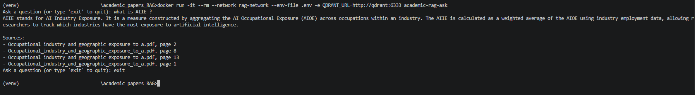

# Academic Papers RAG Assistant

This project is a retrieval-augmented generation (RAG) system for answering questions over a collection of academic papers while grounding each answer in specific, traceable sources.

## What this is

Instead of relying only on an LLM's training data or sending entire documents to the model, the system first retrieves the most relevant passages from a vector database. Only those passages are then provided to the LLM as context for generating the answer.

The corpus contains four academic papers focused on the economic and labor-market effects of artificial intelligence. Using multiple documents makes the system retrieve relevant evidence across different sources rather than relying on a single paper supplied directly in the prompt.

Each retrieved chunk preserves metadata such as the source PDF and page number, allowing the final response to include citations that identify exactly where the supporting information came from.

This follows the standard RAG pattern used in production AI systems to make answers more grounded, scalable, and verifiable as a knowledge base grows.

## Architecture

```
PDFs (docs/) → PyPDFDirectoryLoader → RecursiveCharacterTextSplitter (chunks)
                                              ↓
                                    OpenAI Embeddings
                                              ↓
                                     Qdrant (vector DB)
                                              ↓
User question → embed query → similarity search → top-k chunks
                                              ↓
                          LangChain RetrievalQA + GPT-4o-mini
                                              ↓
                       Answer + citations (source paper, page number)
```

Ingestion (`ingest.py`) and querying (`ask.py`) are deliberately separate scripts: ingesting the papers into Qdrant is a one-time batch step, while answering questions is the actual serving path. The Docker image only packages and runs `ask.py` — re-running ingestion isn't something that needs to happen every time the app starts, only when the source papers change.

## Tech stack

- **Python**
- **OpenAI API** — embeddings and `gpt-4o-mini` for generation
- **LangChain** — document loading, text splitting, retrieval chain (`RetrievalQA`)
- **Qdrant** — vector database, run as its own Docker container
- **Docker** — containerized query app, connected to Qdrant over a custom Docker network

## Setup

### Prerequisites
- Python 3.11+
- Docker Desktop
- An OpenAI API key

### 1. Environment
Create a `.env` file in the project root:
```
OPENAI_API_KEY=your-key-here
```

### 2. Install dependencies (local, for ingestion)
```
pip install -r requirements.txt
```

### 3. Start Qdrant
```
docker run -d --name qdrant -p 6333:6333 -v qdrant_storage:/qdrant/storage qdrant/qdrant
```

### 4. Ingest the papers (one-time)
```
python ingest.py
```
This loads every PDF in `docs/`, chunks it, embeds it, and stores it in Qdrant under the `academic_papers` collection. Only needs to be re-run if the source papers change.

### 5. Ask questions

**Locally:**
```
python ask.py
```

**Or containerized:**
```
docker build -t academic-rag-ask .
docker network create rag-network
docker network connect rag-network qdrant
docker run -it --rm --network rag-network --env-file .env -e QDRANT_URL=http://qdrant:6333 academic-rag-ask
```

## Example

```
Ask a question (or type 'exit' to quit): what is AIIE ?
AIIE stands for AI Industry Exposure. It is a measure constructed by aggregating
the AI Occupational Exposure (AIOE) across occupations within an industry...

Sources:
- Occupational_industry_and_geographic_exposure_to_a.pdf, page 2
- Occupational_industry_and_geographic_exposure_to_a.pdf, page 8
- Occupational_industry_and_geographic_exposure_to_a.pdf, page 13
- Occupational_industry_and_geographic_exposure_to_a.pdf, page 1
```

<details>
<summary>More examples</summary>

**What task structure was used in the generative AI writing experiment?**
```
In the generative AI writing experiment, the task structure prior to the treatment
involved participants spending about 25% of their time brainstorming, 50% writing
a rough draft, and 25% editing. Post-treatment, the share of time spent writing a
rough draft fell by more than half, while the share of time spent editing more
than doubled.

Sources:
- Noy_Zhang_1_0.pdf, page 7
- Noy_Zhang_1_0.pdf, page 1
- Noy_Zhang_1_0.pdf, page 1
- Noy_Zhang_1_0.pdf, page 8
```

**How is occupational exposure calculated?**
```
Occupational exposure to AI technology is calculated using the O*NET occupational
definitions and the O*NET 24.3 database:

1. Aggregate Exposure: scaled by the breadth of abilities required in that occupation.
2. Ranking: occupations are ranked by AI exposure after adjustment.
3. SOC Classification: O*NET data is organized by 8-digit SOC, collapsed to 6-digit
   to align with other major data sources.
4. Application-Ability Relatedness: exposure is calculated by collapsing applications
   to the 52 O*NET occupational abilities.
5. Formula: ability-level exposure (Aij) sums the application-ability relatedness
   scores across all AI applications for that ability.
6. Equal Weighting: each application is weighted equally, summed without adjustment.

Sources:
- Occupational_industry_and_geographic_exposure_to_a.pdf, page 6
- Occupational_industry_and_geographic_exposure_to_a.pdf, page 7
- Occupational_industry_and_geographic_exposure_to_a.pdf, page 6
- Occupational_industry_and_geographic_exposure_to_a.pdf, page 7
```

</details>



## Known limitations

The current system uses plain dense cosine-similarity retrieval, which worked well for targeted factual questions but struggled with some queries involving exact author names, proper nouns, or requests that require understanding a paper more broadly.

For example, the question "What did Noy & Zhang argue in their paper?" sometimes retrieved higher-scoring chunks from a different paper instead of the relevant Noy & Zhang paper. Because the system simply retrieves the top-k most semantically similar chunks, it has no explicit mechanism for filtering by author, identifying the intended document, or performing whole-document summarization.

## Future improvements

- **Conversational memory** — each question is currently answered independently, with no awareness of prior questions in the same session. Would need something like `ConversationalRetrievalChain` with a memory object, plus follow-up query reformulation.
- **Hybrid retrieval for structured data** — embeddings don't preserve exact numeric/tabular data well; a conventional store (SQL/CSV) alongside the vector store would help with questions about specific figures or regression results.
- **Hybrid sparse+dense search, re-ranking, query rewriting (HyDE), agentic/iterative retrieval** — standard mitigations for the proper-noun/summarization weakness noted above.

---
*Part of a transition from applied econometrics into AI/ML engineering.*
